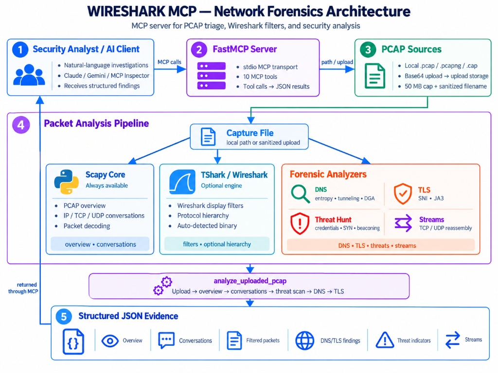

# Wireshark MCP - AI-Powered Network Forensics

> **Automated packet triage, TLS fingerprinting, and threat hunting for LLMs.**

---

## Description

Wireshark MCP is a production-grade Model Context Protocol (MCP) server engineered specifically for Security Engineers, Incident Responders, Network Architects, and SOC Analysts. It connects Large Language Models (such as Google Gemini, Anthropic Claude, and OpenAI GPT-4) directly to network packet analysis engines.

Instead of manually navigating Wireshark desktop GUIs, crafting complex display filters, or converting PCAP bytes by hand, security teams can pair program with an AI assistant to triage packet captures (.pcap, .pcapng, .cap) in natural language. The server natively parses protocol hierarchies, extracts TLS ClientHello metadata and JA3 fingerprints, calculates Shannon entropy for DNS tunneling/DGA detection, hunts for cleartext credential exposures, and reassembles full-duplex TCP/UDP conversations into structured JSON evidence.

---

## Key Features

- **Dual-Engine Processing:**
  - **TShark Engine:** Executes native Wireshark display filter queries (-Y) and statistics when tshark CLI is installed.
  - **Pure-Python Engine (scapy):** 100% memory-safe fallback that runs natively anywhere without requiring Wireshark pre-installed.
- **Automated Threat Hunting & Credential Hunter:**
  - Decodes HTTP Basic Authentication headers from Base64 into cleartext credentials.
  - Extracts plaintext FTP USER / PASS commands, Telnet terminal interactions, and API keys passed in HTTP POST bodies.
  - Detects TCP SYN port scanning sweeps and reconnaissance activities.
  - Identifies periodic, low-jitter Command-and-Control (C2) heartbeat beaconing intervals.
- **DNS Exfiltration & DGA Forensics:**
  - Calculates Shannon entropy across domains and subdomains to flag encrypted/base64 tunneling exfiltration.
  - Flags excessive subdomain lengths, high NXDOMAIN failure ratios, and oversized TXT / NULL records.
- **Cryptographic Forensics & JA3/JA4 Fingerprinting:**
  - Dissects TLS ClientHellos without decrypting payloads.
  - Maps Server Name Indication (SNI) hostnames and computes MD5 JA3 client hashes for malware and client attribution.
- **Conversational Stream Reassembly:**
  - Reassembles bidirectional TCP and UDP flows into complete, ordered, human-readable text transcripts.
- **Dual Ingestion Modes:**
  - Supports absolute local file paths on disk as well as direct Base64-encoded binary payload uploads (upload_pcap / analyze_uploaded_pcap).
- **Enterprise Hardened Security:**
  - Strict path traversal prevention, 50MB upload size caps, subprocess execution timeouts, and prompt injection mitigation.

---

## Execution Modes: Full Wireshark (TShark) vs. Pure-Python (Scapy)

Wireshark MCP is architected to operate under two distinct execution profiles depending on host environment capabilities:

### Mode 1: Full Wireshark Available (TShark Engine Enabled)

When Wireshark or the `tshark` CLI binary is installed on the host (or specified via the `TSHARK_PATH` environment variable), the server unlocks full integration with the native Wireshark dissection ecosystem.

- **Arbitrary Display Filters:** Executes native Wireshark display filter queries (`apply_display_filter`) using Wireshark syntax (for example, `http.response.code >= 400`, `tcp.analysis.retransmission`, or `tls.handshake.type == 1`).
- **Comprehensive Protocol Hierarchy:** Generates native Wireshark protocol tree statistics (`tshark -qz io,phs`) covering thousands of proprietary, industrial, and legacy protocols.
- **Native Stream Following:** Leverages Wireshark's internal reassembly engine (`tshark -qz follow,...`) alongside Scapy reassembly.
- **Ideal Deployment:** Forensic analyst workstations, dedicated security incident response jump-boxes, and development environments where Wireshark desktop or CLI is pre-installed.

### Mode 2: Pure-Python Engine (Scapy Standalone Mode)

When Wireshark or `tshark` is not installed on the system, the server automatically operates in pure-Python Scapy mode with zero degraded security analytical capability for core threat hunting workflows.

- **Zero External Dependencies:** Requires only Python and the packages listed in `requirements.txt`. No system installers, winpcap/npcap drivers, or administrator privileges required.
- **Memory Safety:** 100% Python-native packet parsing eliminates exposure to C-level binary memory corruption or buffer overflow vulnerabilities that historically affect legacy protocol dissectors.
- **Full Threat Hunting Suite Active:** DNS Shannon entropy calculations, DGA detection, TLS SNI extraction, JA3 client fingerprinting with RFC 8701 GREASE stripping, credential extraction (HTTP Basic Auth, FTP, Telnet, POST secrets), port scan detection, C2 beaconing analysis, and stream reassembly function completely natively.
- **Ideal Deployment:** Minimal Docker containers, Kubernetes pods, AWS Lambda or cloud serverless environments, CI/CD security audit pipelines, and locked-down enterprise hosts without software installation rights.

### Feature Comparison Matrix

| Feature / Capability | Full Wireshark (TShark) Mode | Pure-Python (Scapy) Mode |
| :--- | :--- | :--- |
| **System Prerequisites** | Wireshark or tshark in PATH / env | Python 3.10+ only (zero system installs) |
| **Native Display Filters (`apply_display_filter`)** | Supported (full Wireshark syntax) | Requires TShark (returns guidance message) |
| **Protocol Hierarchy Statistics** | Supported (tshark `-qz io,phs`) | Supported (Layer 2-7 Scapy breakdown) |
| **DNS Shannon Entropy & DGA Detection** | Supported (Python forensic engine) | Supported (Python forensic engine) |
| **TLS SNI Extraction & JA3 Fingerprinting** | Supported (Python forensic engine) | Supported (Python forensic engine) |
| **Cleartext Credential Hunting** | Supported (HTTP/FTP/Telnet/POST) | Supported (HTTP/FTP/Telnet/POST) |
| **TCP SYN Port Scan Detection** | Supported | Supported |
| **Periodic C2 Beaconing Analysis** | Supported (low-jitter timing analyzer)| Supported (low-jitter timing analyzer)|
| **TCP / UDP Stream Reassembly** | Supported (Dual: TShark & Scapy) | Supported (Native Scapy reassembly) |
| **Base64 Direct Upload & Triage** | Supported | Supported |
| **C-Level Binary Exploit Immunity** | Dependent on host Wireshark version | 100% memory-safe Python execution |
| **Container & Cloud Portability** | Requires multi-MB Wireshark packages | Lightweight, instant container startup |

---

## System Architecture

The following diagram illustrates the complete end-to-end architecture of the Wireshark MCP system, showing how the AI client, FastMCP server, PCAP sources, packet analysis pipeline, and structured JSON evidence interact:

<div align="center">
  
  <br>
  <b>Figure 1: Wireshark MCP - Network Forensics Architecture</b>
</div>

---

### Flow-by-Flow Explanation of the Architecture

1. **Stage 1 - Security Analyst / AI Client:** The investigation begins when an analyst submits a natural-language query through an AI interface (Google Gemini in Antigravity, Claude Desktop, or MCP Inspector). The client issues standardized MCP tool calls and ultimately receives structured forensic findings.
2. **Stage 2 - FastMCP Server:** Operating over standard input/output (stdio) transport, the FastMCP server hosts 10 specialized MCP tools. It validates incoming parameters, enforces execution timeouts, routes calls to the appropriate engines, and marshals tool responses into JSON results.
3. **Stage 3 - PCAP Sources:** Capture data enters the system through two distinct pathways: direct local file paths on disk (.pcap, .pcapng, .cap), or Base64 binary uploads directed to sandboxed session storage (`TEMP/wireshark_mcp_uploads`). Uploads are protected by a strict 50 MB size ceiling and filename sanitization against path traversal.
4. **Stage 4 - Packet Analysis Pipeline:** The capture file is processed through three complementary analysis branches:
   - **Scapy Core (Always Available):** Parses packet metadata, duration, start/end timestamps, protocol distribution, and bidirectional IP/TCP/UDP conversations in pure, memory-safe Python.
   - **TShark / Wireshark (Optional Engine):** If the binary is discovered on the host system, it provides native Wireshark display filter evaluation (`apply_display_filter`) and comprehensive protocol hierarchy statistics (`io,phs`).
   - **Forensic Analyzers:** Specialized analytical engines inspect packet layers for security anomalies:
     - **DNS:** Computes Shannon entropy, flags high-entropy data exfiltration tunneling, DGA domains, and NXDOMAIN spikes.
     - **TLS:** Extracts unencrypted Server Name Indication (SNI) hostnames and computes MD5 JA3 client hashes with RFC 8701 GREASE stripping.
     - **Threat Hunt:** Scans raw payloads for cleartext credentials (HTTP Basic Auth, FTP, Telnet, POST secrets), TCP SYN port scans, and periodic C2 beaconing timing.
     - **Streams:** Reassembles full-duplex TCP/UDP conversational streams into readable payload transcripts.
   - **Automated Ingestion Pipeline (`analyze_uploaded_pcap`):** For uploaded captures, this automated chain runs end-to-end in sequence: `Upload -> overview -> conversations -> threat scan -> DNS -> TLS`.
5. **Stage 5 - Structured JSON Evidence & Loop Back:** The analysis results are compiled into categorized, typed JSON evidence objects (Overview, Conversations, Filtered packets, DNS/TLS findings, Threat indicators, and Streams). This evidence is returned through the MCP stdio channel back to Stage 1, where the AI assistant synthesizes it into a comprehensive root-cause forensic report for the analyst.

---

## Tech Stack

| Component | Technology | Purpose |
| :--- | :--- | :--- |
| **Language** | Python 3.10+ | Core programming language |
| **MCP Protocol** | mcp>=1.0.0 (Official MCP Python SDK) | Standardized Model Context Protocol client-server transport |
| **Packet Parsing** | scapy>=2.5.0 | Pure-Python raw packet decoding, Layer 2-7 dissection, PCAP reading/writing |
| **Native Engine** | Wireshark tshark CLI | Full Wireshark display filter execution and statistics |
| **Validation** | pydantic>=2.0.0 | Strict data validation and schema definitions |
| **Testing** | pytest>=8.0.0 | Comprehensive unit and integration test suite |

---

## Setup & Installation

Follow these step-by-step instructions. This guide assumes the only tool currently installed on your system is **Git**.

### Step 1: Clone the Repository

Open your terminal (PowerShell, Command Prompt, or Terminal) and clone the repository:

```bash
git clone https://github.com/ritvikindupuri/Wireshark_MCP.git
cd Wireshark_MCP
```

---

### Step 2: Install Python (Version 3.10 or Higher)

If Python is not already installed on your system, install it using your platform's package manager:

#### On Windows:
Open PowerShell and run:
```powershell
winget install Python.Python.3.12
```
*Note: If installing manually from [python.org](https://www.python.org/downloads/), ensure you check the box labeled "Add python.exe to PATH" during installation.*

#### On macOS:
Install Python via Homebrew:
```bash
brew install python@3.12
```

#### On Linux (Ubuntu / Debian):
```bash
sudo apt update && sudo apt install -y python3 python3-pip python3-venv
```

Verify your installation:
```bash
python --version
```
*(On macOS/Linux, use `python3 --version` if `python` points to an older system version).*

---

### Step 3: Create and Activate a Virtual Environment

Isolate project dependencies inside a dedicated virtual environment:

#### On Windows (PowerShell):
```powershell
python -m venv venv
.\venv\Scripts\Activate.ps1
```
*Note: If PowerShell restricts script execution, run `Set-ExecutionPolicy -Scope Process -ExecutionPolicy Bypass` in your session, then re-run the activation script.*

#### On macOS / Linux:
```bash
python3 -m venv venv
source venv/bin/activate
```

---

### Step 4: Install Dependencies

Install all required Python libraries (mcp, scapy, pydantic, and pytest):

```bash
pip install -r requirements.txt
```

---

### Step 5: (Optional) Install Wireshark / TShark Engine

Wireshark is **optional**. If skipped, the server automatically runs in pure-Python Scapy mode with all threat hunting, DNS entropy, TLS JA3, credential hunting, and stream reassembly features active.

To unlock native Wireshark display filter queries (`apply_display_filter`) and full protocol hierarchy trees (`io,phs`):

#### On Windows:
```powershell
winget install WiresharkFoundation.Wireshark
```

#### On macOS:
```bash
brew install wireshark
```

#### On Linux (Ubuntu / Debian):
```bash
sudo apt install -y tshark
```

---

### Step 6: Verify the Installation

Run the automated test suite against synthetic multi-vector captures:

```bash
python -m pytest -v
```

All 15 tests should pass.

---

### Step 7: Configure in Your AI Assistant

Determine the absolute path to your Python executable:
- Windows (PowerShell): `(Get-Command python).Source` or `(Get-Item .\venv\Scripts\python.exe).FullName`
- macOS / Linux: `which python` or `readlink -f venv/bin/python`

#### For Antigravity:
Open `~/.gemini/config/mcp_config.json` (on Windows: `C:\Users\<username>\.gemini\config\mcp_config.json`) and add:

```json
{
  "mcpServers": {
    "wireshark": {
      "command": "python",
      "args": [
        "-m",
        "wireshark_mcp.server"
      ],
      "env": {
        "PYTHONPATH": "<ABSOLUTE_PATH_TO_Wireshark_MCP_DIRECTORY>"
      }
    }
  }
}
```

#### For Claude Desktop:
Open `%APPDATA%\Claude\claude_desktop_config.json` (on macOS: `~/Library/Application Support/Claude/claude_desktop_config.json`) and add:

```json
{
  "mcpServers": {
    "wireshark": {
      "command": "python",
      "args": [
        "-m",
        "wireshark_mcp.server"
      ],
      "cwd": "<ABSOLUTE_PATH_TO_Wireshark_MCP_DIRECTORY>"
    }
  }
}
```

---

## Why Gemini in Antigravity is Uniquely Suited

When running Wireshark MCP inside the Antigravity IDE, Google Gemini models (specifically **Gemini 1.5 Pro** and **Gemini 2.0 Flash / Pro**) provide distinct architectural advantages for network forensics and packet inspection:

1. **Massive Context Window (1M - 2M Tokens):**
   Packet captures and reconstructed conversational streams generate extensive text volumes. While standard models with 32K or 128K token limits quickly saturate or force aggressive truncation, **Gemini 1.5 Pro** natively ingests full multi-megabyte stream transcripts, thousands of DNS queries, and long conversation tables in a single prompt without losing needle-in-a-haystack threat indicators.

2. **Advanced Multi-Modal & Structured JSON Reasoning:**
   Network forensics outputs contain nested, heterogeneous JSON data structures (JA3 hashes, cipher arrays, Shannon entropy floating-point scores, IP-to-port maps). **Gemini 2.0 Flash** excels at high-speed structured data correlation—matching a high-entropy subdomain from `extract_dns_forensics` to an encrypted external TLS handshake extracted by `extract_tls_fingerprints` from the same client IP.

3. **Autonomous Multi-Step Tool Calling:**
   Gemini's function-calling engine natively orchestrates multi-tool investigation pipelines in a single user turn (e.g., executing `pcap_overview` -> detecting an anomaly -> calling `scan_suspicious_indicators` -> calling `follow_stream` on the suspicious flow -> synthesizing a root-cause incident report).

---

## How to Use the App (Step-by-Step Walkthrough)

### Step 1: Open Your AI Assistant
Launch Antigravity IDE (with Gemini) or Claude Desktop. Ensure the wireshark MCP server is active in your configuration.

---

### Step 2: Check Engine Status
Ask your assistant:
> "Check the status of the Wireshark analysis engines."

**Expected Output:** The AI calls `get_engine_status()` and confirms whether tshark is discovered and lists all 10 active analysis capabilities.

---

### Step 3: Run Rapid PCAP Triage on an Existing File
Provide any .pcap or .pcapng path on your disk:
> "Run an end-to-end incident triage on C:\Users\ritvi\.gemini\antigravity\scratch\wireshark-mcp\sample_attack.pcap."

**The AI automatically:**
1. Calls `pcap_overview` -> Reports duration, packet count, and protocol distribution.
2. Calls `scan_suspicious_indicators` -> Uncovers plaintext credentials (HTTP Basic Auth, FTP credentials) and port scans.
3. Calls `extract_dns_forensics` -> Flags high-entropy DNS tunneling queries and DGA domains.
4. Calls `extract_tls_fingerprints` -> Extracts JA3 hashes and SNIs.

---

### Step 4: Reassemble and Read a Specific Conversation Stream
When you spot a suspicious communication:
> "Follow and reconstruct TCP stream #0 in sample_attack.pcap."

**The AI outputs:** The exact HTTP GET/POST headers, payloads, or raw conversation transcript.

---

### Step 5: Capture Live Traffic Directly from Your Machine
If you do not have a capture file on hand:
> "Capture 50 live packets from my network adapter and analyze the traffic."

**The AI will:**
1. Execute a live network sniff via Scapy on your network card.
2. Save the trace to `live_sniff_50.pcap`.
3. Dissect local mDNS devices, active endpoints, and security indicators.

---

### Step 6: Test with the Interactive MCP Inspector UI
To visually test all tools in a web dashboard:
```powershell
npx @modelcontextprotocol/inspector python -m wireshark_mcp.server
```
1. Open your browser to `http://localhost:5173`.
2. Click on any tool (e.g. `pcap_overview`, `extract_dns_forensics`).
3. Enter arguments and click Run Tool to inspect live JSON responses.

---

## Technical Documentation

For the comprehensive engineering architecture, mathematical formulas, agent workflows, security threat model, and detailed feature specifications:

[Read the Full Technical Documentation](TECHNICAL_DOCUMENTATION.md)

---

## License & Author

- **Author:** Ritvik Indupuri
- **Version:** 0.1.0
- **License:** MIT