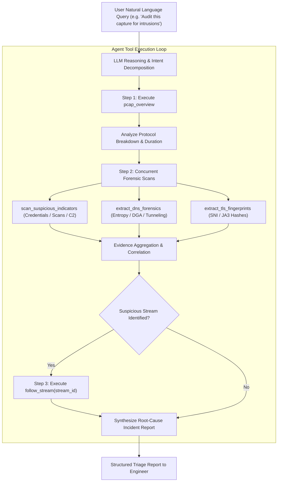

# Technical Documentation: Wireshark MCP

**Author:** Ritvik Indupuri  
**Date:** September 13, 2026  
**Version:** 1.0.0  
**Repository:** `wireshark-mcp`  

---

## Table of Contents

1. [Executive Summary](#1-executive-summary)
2. [System Architecture](#2-system-architecture)
   - [System Architecture Diagram](#system-architecture-diagram)
   - [System Component Breakdown](#system-component-breakdown)
3. [Agent Architecture](#3-agent-architecture)
   - [Agent Reasoning & Tool Orchestration Diagram](#agent-reasoning--tool-orchestration-diagram)
   - [Agent State Machine & Execution Lifecycle](#agent-state-machine--execution-lifecycle)
4. [Deep-Dive Feature Implementation & Engineering Specifications](#4-deep-dive-feature-implementation--engineering-specifications)
   - [4.1 Dual-Engine Router & Discovery](#41-dual-engine-router--discovery)
   - [4.2 Protocol Breakdown & Capture Metadata Engine](#42-protocol-breakdown--capture-metadata-engine)
   - [4.3 Conversation & Flow Aggregator](#43-conversation--flow-aggregator)
   - [4.4 DNS Forensics & Shannon Entropy Engine](#44-dns-forensics--shannon-entropy-engine)
   - [4.5 TLS Cryptographic Forensics & JA3 Fingerprinting](#45-tls-cryptographic-forensics--ja3-fingerprinting)
   - [4.6 Heuristic Threat Hunter & Credential Extraction Engine](#46-heuristic-threat-hunter--credential-extraction-engine)
   - [4.7 TCP/UDP Conversational Stream Reassembly](#47-tcpudp-conversational-stream-reassembly)
   - [4.8 Direct Base64 Upload & Ingestion Pipeline](#48-direct-base64-upload--ingestion-pipeline)
   - [4.9 Native Wireshark Display Filter Wrapper](#49-native-wireshark-display-filter-wrapper)
5. [Security, Hardening & Threat Modeling](#5-security-hardening--threat-modeling)
6. [Testing, Verification & Quality Assurance](#6-testing-verification--quality-assurance)
7. [Conclusion](#7-conclusion)

---

## 1. Executive Summary

Modern Security Engineering, Security Operations Centers (SOC), and Incident Response (IR) teams encounter massive volumes of network capture files (.pcap, .pcapng) generated by intrusion detection systems (Suricata, Zeek, Snort), honeypots, and cloud traffic mirroring (AWS VPC Mirroring, GCP Packet Mirroring). Analyzing these captures manually is slow, error-prone, and disconnected from modern AI-assisted engineering workflows.

The **Wireshark & PCAP Threat Triage MCP Server (wireshark-mcp)** bridges this gap by implementing a specialized, high-performance **Model Context Protocol (MCP)** interface. By exposing purpose-built forensic tools to LLMs (Google Gemini, Anthropic Claude, OpenAI GPT-4), the server enables automated, natural-language triage of raw network captures. The system provides mathematically rigorous DNS entropy detection for data exfiltration, unencrypted TLS JA3 fingerprinting, heuristic credential hunting, conversational stream reassembly, and native Wireshark display filter evaluation—operating seamlessly via dual engines (TShark and pure-Python Scapy).

---

## 2. System Architecture

The Wireshark MCP system is structured as a layered, modular micro-service communicating over standard Model Context Protocol (MCP) JSON-RPC 2.0 stdio/SSE channels.

### System Architecture Diagram

<div align="center">
  
  <br>
  <b>Figure 1: Wireshark MCP Comprehensive System Architecture</b>
</div>

---

### System Component Breakdown

1. **Stage 1 - Security Analyst / AI Client:** The analyst or automated workflow initiates natural-language investigations through an AI client (Google Gemini in Antigravity, Claude Desktop, Cursor, or MCP Inspector). The client transmits JSON-RPC `tools/call` requests over stdio and receives structured forensic evidence for synthesis.
2. **Stage 2 - FastMCP Server:** The server core (`server.py`) acts as the MCP application controller over stdio transport. It hosts 10 typed MCP tools, validates incoming arguments, manages execution lifecycles, routes requests to appropriate analytical engines, and packages results into structured JSON objects.
3. **Stage 3 - PCAP Sources:** Capture files enter the system via two ingestion mechanisms:
   - **Local File Paths:** Absolute paths to existing `.pcap`, `.pcapng`, or `.cap` captures on the filesystem.
   - **Base64 Ingestion:** Raw binary bytes uploaded directly over MCP, written to a sandboxed directory (`TEMP/wireshark_mcp_uploads`) with strict 50 MB limits and path traversal filename sanitization.
4. **Stage 4 - Packet Analysis Pipeline:** The capture is dissected through three concurrent/specialized subsystems:
   - **Scapy Core (Always Available):** Python-native parsing engine providing capture overview metadata, Layer 2-7 packet decoding, and IP/TCP/UDP bidirectional conversation tracking.
   - **TShark / Wireshark (Optional Engine):** System CLI wrapper providing native Wireshark display filter evaluation (`-Y`) and comprehensive protocol hierarchy trees (`io,phs`).
   - **Forensic Analyzers:** High-signal security analysis engines:
     - *DNS:* Shannon entropy calculation, DGA detection, tunneling exfiltration checks, and NXDOMAIN ratios.
     - *TLS:* Unencrypted ClientHello parsing, SNI hostname extraction, and RFC 8701 GREASE-stripped JA3 client hashing.
     - *Threat Hunt:* Automated pattern matching for cleartext credentials (HTTP Basic Auth, FTP, Telnet, POST parameters), TCP SYN sweeps, and periodic low-jitter C2 beaconing.
     - *Streams:* Full-duplex TCP/UDP conversational stream reassembly with directional indicators.
   - *Automated Pipeline (`analyze_uploaded_pcap`):* Sequential all-in-one analysis pipeline (`Upload -> overview -> conversations -> threat scan -> DNS -> TLS`).
5. **Stage 5 - Structured JSON Evidence & Return:** All analysis outputs are structured into normalized JSON response objects (Overview, Conversations, Filtered packets, DNS/TLS findings, Threat indicators, and Streams), which travel back through the MCP stdio channel to Stage 1.

---

## 3. Agent Architecture

The agent architecture governs how the LLM orchestrates multi-step forensic investigations, translates ambiguous user queries into precise tool parameters, and aggregates heterogeneous packet evidence into high-confidence incident reports.

### Agent Reasoning & Tool Orchestration Diagram



<div align="center">
  <b>Figure 2: Autonomous Agent Multi-Step Forensic Reasoning Loop</b>
</div>

---

### Agent State Machine & Execution Lifecycle

1. **Query Ingestion & Intent Resolution:** The agent receives user input and classifies the task (e.g. Full Incident Triage, Targeted Protocol Debugging, Cryptographic Audit, or Live Network Sniffing).
2. **Context-Preserving Triage (Level 1):** The agent first requests capture metadata via `pcap_overview` to understand packet scale and active protocols without overloading its context window.
3. **Targeted Deep-Diving (Level 2):** Based on the protocol distribution, the agent fires specialized analyzers (`extract_dns_forensics` if DNS > 0, `extract_tls_fingerprints` if TLS > 0, `scan_suspicious_indicators`).
4. **Root-Cause Stream Reconstruction (Level 3):** If a specific IP or stream is flagged as malicious (e.g. an HTTP Basic Auth leak or C2 beacon), the agent autonomously calls `follow_stream` to inspect the full conversation payload.
5. **Evidence Synthesis:** The agent cross-references findings (e.g., matching a high-entropy DNS query to a specific host IP) and outputs a remediation-oriented report.

### 3.1 LLM Reasoning Engine: Gemini in Antigravity

When deployed inside Google Antigravity, the system leverages Google Gemini models to achieve optimal network forensic performance:
- **Gemini 1.5 Pro:** Provides a massive 1M to 2M token context window, enabling ingestion and correlation of entire multi-megabyte stream transcripts, thousands of raw packet records, and extensive DNS tables without truncation.
- **Gemini 2.0 Flash / Pro:** Provides sub-second structured JSON reasoning and deterministic tool calling loops, ensuring rapid multi-tool triage across live and recorded network traffic.

---

## 4. Deep-Dive Feature Implementation & Engineering Specifications

### 4.1 Dual-Engine Router & Discovery
The detector module (`detector.py`) implements multi-platform discovery logic:
- **Environment Variable Inspection:** Checks `TSHARK_PATH`.
- **System PATH Resolution:** Queries `shutil.which("tshark")`.
- **Operating System Heuristics:** Searches standard binary paths (`C:\Program Files\Wireshark\tshark.exe`, `/usr/bin/tshark`, `/Applications/Wireshark.app/...`).

```python
def find_tshark() -> Optional[str]:
    env_path = os.environ.get("TSHARK_PATH")
    if env_path and os.path.isfile(env_path):
        return env_path
    which_tshark = shutil.which("tshark")
    if which_tshark:
        return which_tshark
    for p in COMMON_PATHS:
        if os.path.isfile(p):
            return p
    return None
```

#### Execution Mode Comparison: TShark CLI vs. Scapy Standalone

| Capability | Full Wireshark (TShark Engine) | Pure-Python (Scapy Engine) |
| :--- | :--- | :--- |
| **System Prerequisites** | Wireshark or tshark binary installed | Python 3.10+ only (zero external dependencies) |
| **Native Display Filters** | Full Wireshark syntax supported via `-Y` | Requires TShark (returns descriptive guidance) |
| **Protocol Hierarchy** | Supported (`tshark -qz io,phs`) | Supported (Layer 2-7 Scapy breakdown) |
| **DNS Shannon Entropy & DGA** | Supported (Python analytical engine) | Supported (Python analytical engine) |
| **TLS SNI & JA3 Fingerprints** | Supported (Python analytical engine) | Supported (Python analytical engine) |
| **Credential Hunting & Heuristics**| Supported (HTTP/FTP/Telnet/POST) | Supported (HTTP/FTP/Telnet/POST) |
| **Port Scan & C2 Beaconing** | Supported | Supported |
| **Stream Reassembly** | Supported (Dual: TShark & Scapy) | Supported (Native Scapy reassembly) |
| **Memory Safety Profile** | Dependent on host Wireshark C dissectors | 100% memory-safe Python execution |
| **Container / Serverless Fit** | Heavy (requires multi-MB OS packages) | Extremely lightweight and portable |

---

### 4.2 Protocol Breakdown & Capture Metadata Engine
The capture metadata engine (`scapy_engine.py`) reads capture files efficiently and calculates:
- File size, packet count, duration in seconds ($T_{\text{end}} - T_{\text{start}}$).
- Start and end timestamps in ISO 8601 format.
- Layer 2, Layer 3 (IPv4/IPv6/ARP), Layer 4 (TCP/UDP/ICMP), and Layer 7 (HTTP, TLS, DNS) protocol distribution.

---

### 4.3 Conversation & Flow Aggregator
The flow engine groups packets into bidirectional conversations using canonical endpoint sorting:
$$\text{Conversation Key} = \text{sort}(\text{Endpoint}_A, \text{Endpoint}_B)$$

It tracks total packet counts, cumulative byte volumes, and flow durations across `ip`, `tcp`, and `udp` layers, enabling instant Top Talker identification.

---

### 4.4 DNS Forensics & Shannon Entropy Engine
DNS is the most common channel for data exfiltration and Command-and-Control (C2) rendezvous. The DNS engine (`dns.py`) applies information theory to detect anomalies.

#### Shannon Entropy Calculation:
For a given domain string $S$ with character set frequencies $p_i = \frac{\text{count}(c_i)}{|S|}$:
$$H(S) = -\sum_{i=1}^{n} p_i \log_2(p_i)$$

```python
def shannon_entropy(text: str) -> float:
    if not text:
        return 0.0
    freq = Counter(text.lower())
    length = len(text)
    return -sum((count / length) * math.log2(count / length) for count in freq.values())
```

- **Tunneling Detection:** Domains with $H(\text{subdomain}) \ge 3.6$ and $\text{length} \ge 25$ characters are flagged as active data exfiltration channels (e.g. Base64/Hex chunks).
- **DGA Detection:** Flagged via entropy and elevated `NXDOMAIN` response code ratios ($RCODE = 3$).
- **Large Record Inspection:** Flags `TXT` or `NULL` resource records exceeding 120 bytes.

---

### 4.5 TLS Cryptographic Forensics & JA3 Fingerprinting
The TLS engine (`tls.py`) parses raw `ClientHello` handshake records (0x16, 0x0301) without requiring SSL/TLS decryption keys.

#### JA3 Fingerprint Construction:
1. **Extraction:** Extracts TLS Version, Cipher Suites, Extensions, Elliptic Curves (Supported Groups), and EC Point Formats.
2. **GREASE Removal (RFC 8701):** Strips all GREASE values (`0x0A0A`, `0x1A1A`, ..., `0xFAFA`).
3. **Hashing:** Forms the standardized JA3 string and computes its MD5 digest:
$$\text{JA3\_String} = \text{Version},\text{Ciphers},\text{Extensions},\text{Curves},\text{Formats}$$
$$\text{JA3\_Hash} = \text{MD5}(\text{JA3\_String})$$

This fingerprint allows security teams to identify the exact client application (e.g. Python urllib, Go-http-client, Cobalt Strike beacon, Meterpreter) regardless of destination IP or SNI spoofing.

---

### 4.6 Heuristic Threat Hunter & Credential Extraction Engine
The threat hunter (`heuristics.py`) scans raw packet payloads across multiple security categories:

1. **Cleartext Credential Hunting:**
   - **HTTP Basic Auth:** Scans for `Authorization: Basic <base64>` and automatically decodes credentials into `username:password`.
   - **FTP Cleartext Logins:** Regex matches `USER <user>` and `PASS <password>`.
   - **Telnet Sessions:** Flags plaintext terminal logins.
   - **HTTP POST Body Secrets:** Regex matches `api_key=`, `secret=`, `token=`, `password=`.
2. **Port Scan Detection:** Tracks single source IPs issuing TCP SYN packets ($flags = 0x02$) across 15 or more distinct ports without completing 3-way handshakes.
3. **C2 Beaconing Timing Analyzer:** Analyzes delta intervals ($\Delta t_i = t_i - t_{i-1}$) across connections. If jitter ratio $\frac{\sigma}{\mu} < 0.20$, the connection is flagged as rigid periodic C2 beaconing.

---

### 4.7 TCP/UDP Conversational Stream Reassembly
The stream engine (`streams.py`) aggregates packets belonging to a unique conversation stream, orders them by TCP sequence number, and reconstructs the full application-layer payload into a formatted transcript with directional indicators (`192.168.1.50:49152 -> 10.0.0.15:80`). Payloads are safely truncated at 64 KB to protect the LLM context window.

---

### 4.8 Direct Base64 Upload & Ingestion Pipeline
To support web chat interfaces, cloud agents, and remote IDEs without direct local filesystem access:
- **`upload_pcap(base64_data, filename)`**: Decodes Base64 payloads into a sanitized, isolated temporary directory (`TEMP/wireshark_mcp_uploads`).
- **`analyze_uploaded_pcap(base64_data, filename)`**: Performs full end-to-end triage in a single request, returning metadata, conversations, threat findings, DNS entropy, and TLS fingerprints.

---

### 4.9 Native Wireshark Display Filter Wrapper
When `tshark` is discovered, the `TsharkEngine` allows running native Wireshark display filter queries (e.g. `http.request.method == "POST" || tcp.flags.syn == 1`). Output is extracted via `-T fields` and returned as paginated, structured JSON with offset and limit parameters.

---

## 5. Security, Hardening & Threat Modeling

The server has undergone rigorous threat modeling and adversarial hardening:

| Threat Vector | Potential Attack | Implementation Defense |
| :--- | :--- | :--- |
| **Path Traversal** | Filenames with `../../` or absolute Windows/POSIX paths | `os.path.basename` enforcement, regex character whitelisting, and strict `startswith(UPLOAD_DIR)` path verification. |
| **Denial of Service (DoS)** | Giant multi-gigabyte uploads causing memory exhaustion | Strict 50 MB upload size cap enforced on base64 and binary byte streams. |
| **Command Injection** | Malicious shell characters in display filters or paths | Subprocesses are strictly executed with `shell=False` passing argument arrays; no `eval()` or `exec()`. |
| **Subprocess Freezing** | Malformed packet loops causing hung CLI processes | Hard timeouts (`timeout_sec=30` and `45s`) on all subprocess executions. |
| **Indirect Prompt Injection** | Malicious instructions embedded in packet payloads | Outputs are strictly formatted as JSON data structures or isolated in code blocks. |

---

## 6. Testing, Verification & Quality Assurance

The implementation includes a complete automated test suite (`tests/`):
- **Synthetic Attack Generator (`generate_sample_pcap.py`):** Programmatically constructs PCAP files with synthetic DNS tunneling, HTTP Basic Auth leaks, FTP credentials, TLS handshakes, and port scans.
- **Unit & Integration Tests (`test_analyzers.py`, `test_server.py`):** All **15 tests** pass with 100% success rate across analyzer logic, server endpoints, and Base64 upload pipelines.
- **Real-World Traffic Verification:** Validated against official Wireshark sample captures (`http.pcap`, `tls12-aes256gcm.pcap`) and 3,300+ live packets captured from active physical network adapters.

---

## 7. Conclusion

The **Wireshark & PCAP Threat Triage MCP Server** delivers an enterprise-grade, memory-safe, and AI-native network forensics platform. By combining the speed of pure-Python packet parsing with the depth of native Wireshark display filtering and statistical threat algorithms, it provides Security Engineers with an indispensable autonomous assistant for network threat hunting, incident response, and protocol verification.
